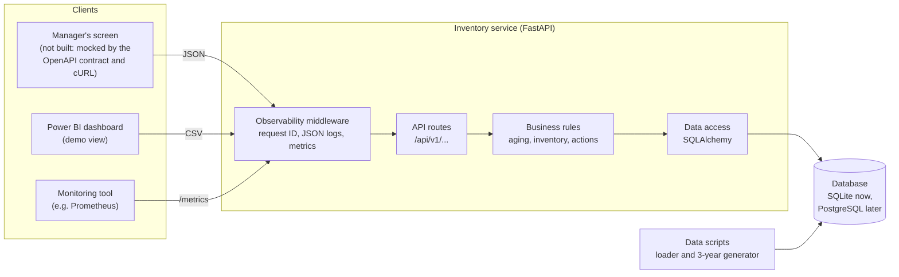
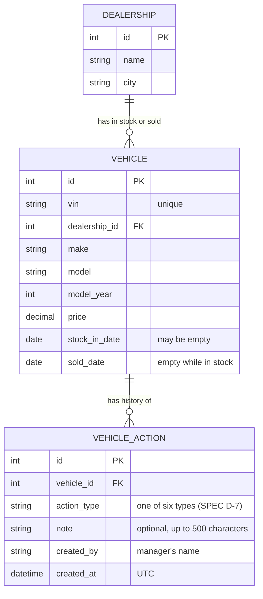
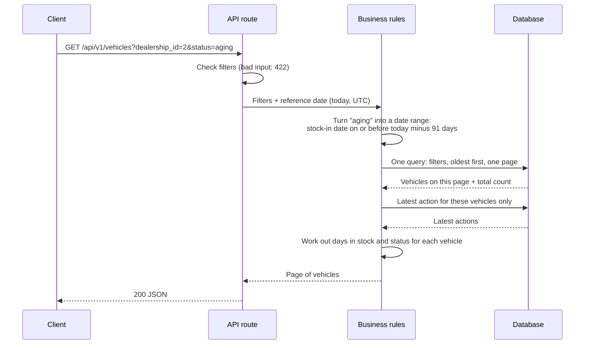
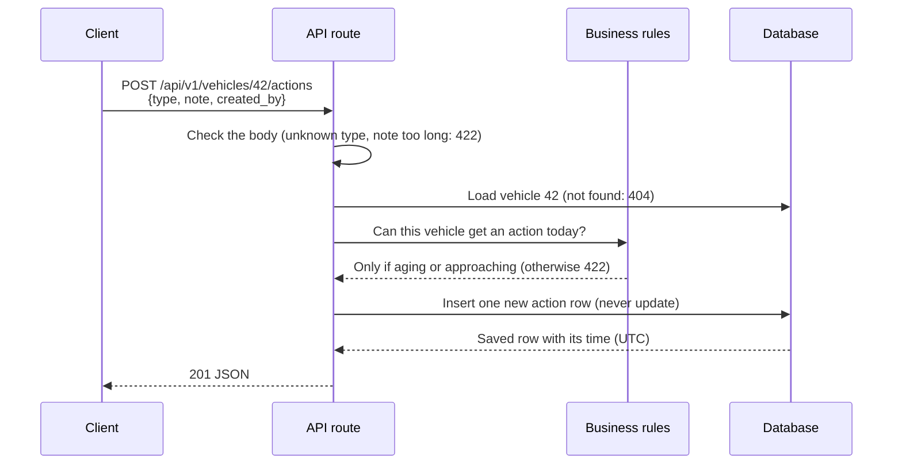

# System Design: Intelligent Inventory Dashboard

This document explains how the service is built and why. It is written for the people
who review, build or run it.

It builds on [`SPEC.md`](SPEC.md), which says *what* the service must do. This document
says *how*. The reasons behind the biggest choices are recorded as short
**ADRs** (Architecture Decision Records) in [`adr/`](adr/).

**Contents**

1. [The system at a glance](#1-the-system-at-a-glance)
2. [Components and their roles](#2-components-and-their-roles)
3. [Data model](#3-data-model)
4. [How data flows](#4-how-data-flows)
5. [Key decisions](#5-key-decisions)
6. [Built for the future](#6-built-for-the-future)
7. [Observability](#7-observability)
8. [Security and privacy](#8-security-and-privacy)
9. [How GenAI was used in the design phase](#9-how-genai-was-used-in-the-design-phase)
10. [Known limits and next steps](#10-known-limits-and-next-steps)

---

## 1. The system at a glance

The service is a single backend with a REST API and a database. The manager's screen is
not part of this assessment (see SPEC section 4), so the API contract stands in for it.
A Power BI dashboard reads CSV exports for the demo.



**The idea in one sentence:** every answer is worked out from the stored facts (when a
car arrived, whether it was sold, what actions were recorded) at the moment someone asks,
so the service is always correct for today without any background jobs.

---

## 2. Components and their roles

| Component | Role | Knows about |
|---|---|---|
| **API routes** (`app/api/`) | Turn HTTP requests into calls to the business rules, check input, and shape the responses. No business logic here. | HTTP, request and response models |
| **Business rules** (`app/services/`) | The logic from the spec: days in stock, stock status, which vehicles may get an action. `aging.py` is plain Python with no web or database code, so it is easy to test and read. | The rules only |
| **Data access** | Build database queries with SQLAlchemy. Turns filters such as "only aging cars" into date ranges the database can search quickly (see 4.1). | Tables and indexes |
| **Database** | Stores dealerships, vehicles and actions. SQLite for this assessment; PostgreSQL in production (ADR 0002). Schema changes go through Alembic migrations. | Data |
| **Observability middleware** | Gives every request an ID, writes one JSON log line per request, and records metrics. | Requests, timings, errors |
| **Data scripts** (`scripts/`) | Load data and generate three years of realistic sample data. The loader rejects bad records (for example a stock-in date in the future). | Data rules |
| **API contract** (`docs/api/`) | The OpenAPI file generated by FastAPI, plus cURL examples. This is how the missing frontend is mocked. | Endpoints |

### Endpoints

| Method and path | Purpose | Spec |
|---|---|---|
| `GET /api/v1/vehicles` | Vehicles in stock, with filters, sorting and paging | R1, R2 |
| `GET /api/v1/vehicles/{id}` | One vehicle, with its status and latest action | R1 |
| `GET /api/v1/inventory/summary` | Counts and the total value of aging stock, for one dealership or all | R2 |
| `GET /api/v1/dealerships` | The dealerships, so a client can offer the dealership filter | R1 |
| `POST /api/v1/vehicles/{id}/actions` | Record an action for an aging or approaching vehicle | R3 |
| `GET /api/v1/vehicles/{id}/actions` | A vehicle's action history, newest first | R3 |
| `GET /api/v1/exports/vehicles.csv` | All vehicles, in stock and sold, for reporting tools | R4 |
| `GET /api/v1/exports/actions.csv` | All actions, for reporting tools | R4 |
| `GET /health` | Is the service up and can it reach the database? | Operations |
| `GET /metrics` | Metrics for a monitoring tool | Operations |

Errors use one shape everywhere, so a client only needs to handle it once:
`{"error": {"code": "...", "message": "...", "details": [...]}}`. The message says what went
wrong and what to do next.

---

## 3. Data model



**What is stored and what is not.** We store only facts: when a car arrived, when it was
sold, and what was done. We do **not** store days in stock, stock status, or "latest
action". Those are worked out when someone asks (ADR 0003 and ADR 0004). Each fact lives
in exactly one place, so two copies can never disagree.

- A vehicle is **in stock** when `sold_date` is empty. There is no separate status column
  that could contradict it.
- `stock_in_date` may be empty. That is how the `unknown` status (SPEC D-6) is possible.
- `VEHICLE_ACTION` is **append-only**. The service has no code that updates or deletes a
  row in this table (SPEC AC-3.6).

**Indexes** (like the index at the back of a book, so the database can find rows without
reading every one):

| Index | Makes this fast |
|---|---|
| `vehicle(dealership_id, sold_date, stock_in_date)` | The main list: one dealership, in stock, by age |
| `vehicle(stock_in_date)` | Filters by age and status across all dealerships |
| `vehicle(make, model)` | Make and model filters |
| `vehicle_action(vehicle_id, created_at)` | A vehicle's history, and its latest action |

---

## 4. How data flows

### 4.1 Listing vehicles



The key step is turning each status into a **range of stock-in dates**, so the database
does the filtering with an index instead of the service loading every car:

| Status | Stock-in date (reference date = *T*) |
|---|---|
| `aging` | on or before *T* − 91 days |
| `approaching` | from *T* − 90 to *T* − 76 days |
| `fresh` | from *T* − 75 days to *T* |
| `unknown` | empty |

The same thresholds are also used to label each vehicle in the response. A test checks
that the filter and the label always agree, including on days 75, 76, 90 and 91.

### 4.2 Recording an action



### 4.3 Exporting for Power BI

Power BI calls the CSV endpoints with "Get Data → Web". The service reads the rows in
batches and **streams** the file, so a large export does not have to fit in memory. Days
in stock and status are worked out by the same code as the API, so the dashboard and the
API can never disagree (SPEC AC-4.1).

### 4.4 Loading data

The loader and the 3-year generator write straight to the database through the same data
models. The loader checks every record first and rejects bad ones with a clear reason, for
example a stock-in date in the future (SPEC AC-2.6), or a sale before the car arrived.

---

## 5. Key decisions

This section walks through the choices that shape the system. For each one: the question
we had to answer, an example that makes it concrete, the options we weighed, what we chose,
and what that choice costs us. The full record of each decision is in its ADR.

**How these decisions were made:** for each question, the AI listed the options and
weighed them; the owner made the final choice (see the AI Collaboration Log).

### 5.1 Which language and framework? ([ADR 0001](adr/0001-stack-python-fastapi.md))

**The question.** What should a new service like this be built with?

**Why it is not obvious.** Several stacks would work. The owner's own strongest background
is Java enterprise, so the easy answer would be Java. But a stack should be chosen for the
product and the team that will own it, not for one person's comfort.

**The setting we assumed.** This is a new service with no existing code to fit into, and
the team that will build and run it is strongest in Python. Both are assumptions, because
there is no real team in this assessment.

| Option | For | Against |
|---|---|---|
| **Python + FastAPI** ✅ | Fits the assumed team. Generates the API contract (OpenAPI) from the code, which the challenge asks for. Checks input automatically. Short, readable tests. | Fewer enterprise conventions built in than Spring. |
| Java + Spring Boot | Mature, widely used in large companies, the owner's strongest background. | Does not match the assumed team. More setup for a small new service. |
| Node.js + TypeScript | Quick to build a small API. | Does not match the assumed team. |

**What it costs.** If the real team works mainly in Java or .NET, this choice should be
revisited. The spec and the API contract would carry over unchanged.

### 5.2 Which database? ([ADR 0002](adr/0002-database-sqlite-with-postgresql-path.md))

**The question.** The challenge asks for a real database that keeps data. Which one?

**Why it is not obvious.** Reviewers need to run the service on their own machine with
no setup. A real deployment needs a database that many copies of the service can share.
These two needs pull in different directions.

| Option | For | Against |
|---|---|---|
| **SQLite now, PostgreSQL later** ✅ | Nothing to install: the database is one file. All code goes through SQLAlchemy, so moving to PostgreSQL means changing one connection setting, not the code. | Only one write at a time. Fine here, not for production. |
| PostgreSQL in Docker from day one | Closest to production. | Every reviewer needs Docker installed and running. |

**How the database structure changes over time.** We also chose **Alembic migrations**
over letting the app create tables when it starts. A migration is a numbered, saved step
such as "add a column". Every database, on a laptop, a test server or in production, runs
the same steps in the same order, so they always end up the same. Creating tables at
start-up is about 30 minutes quicker to set up, but it cannot safely change a database
that already holds data.

**What it costs.** SQLite's one-writer limit is the first thing to change before real use.
We avoid SQLite-only features so that the move stays easy.

### 5.3 When is "aging" worked out? ([ADR 0003](adr/0003-aging-computed-at-read-time.md))

**The question.** Days in stock and stock status change every day, even when nothing about
the car changes. When should the service work them out?

**An example.** Car A arrived on 1 July. On 27 September it has been in stock 88 days, so
it is `approaching`. On 30 September it reaches 91 days and becomes `aging`. The car's
record did not change; only the date did.

| Option | How it works | For | Against |
|---|---|---|---|
| **A. Work it out when asked** ✅ | Store only the stock-in date. On every request, subtract it from today. | Always correct: on the morning a car crosses day 90, it shows as aging. The rule lives in one place. | The thresholds are used in two ways (see below), so a test must keep them in step. |
| B. Store the status, update it nightly | A job runs at midnight and writes each car's status. | The simplest queries. | Wrong between runs. If the job fails, the data stays wrong and nobody is told. One more job to run and watch. |
| C. Load everything, filter in Python | Fetch all cars, then filter in the service. | The simplest code. | Slower with every car added. Finding 30 aging cars among 5,000 means loading all 5,000. |

**How option A stays fast.** When a manager asks for "aging cars only", the service does
not check each car. It turns the question into a date: *"cars that arrived on or before
today minus 91 days"*. The database answers that with an index (like the index at the back
of a book), without reading every row. Section 4.1 shows the date range for each status.

**What it costs.** The thresholds are used in two ways: to label each car in the response,
and to build the date ranges for filters. If these ever drifted apart, a car could be
labelled `aging` but missing from the aging filter. A test checks every boundary (days 75,
76, 90 and 91) in both ways.

### 5.4 How does the list show each car's latest action? ([ADR 0004](adr/0004-latest-action-read-from-history.md))

**The question.** The list shows the most recent action next to each car, so the manager
can see what has already been decided. Where should that come from?

**An example.** Car A has three actions: *Under review* (1 Sep), *Price reduction planned*
(10 Sep), *Send to auction* (25 Sep). The list should show *Send to auction*.

| Option | How it works | For | Against |
|---|---|---|---|
| **A. Look it up in the history** ✅ | Actions live only in the history table. For each page of cars, look up the newest action of each. | Each fact lives in one place, so the list and the history can never disagree. Recording an action only ever adds a row. | One extra lookup per page. With at most 200 cars per page and an index, it stays fast. |
| B. Copy it onto the car's record | When an action is recorded, also write it onto the car. | The fastest lists, no lookup. | The same fact in two places. If a write fails halfway, they can disagree. Every action also changes the car's record, which breaks the "only add, never change" rule. |

**What it costs.** One extra database query per page. If lists ever became very large or
very frequent, the next step would be a short-lived cache, not copying data onto the car.

### 5.5 How do we see what the service is doing? ([ADR 0005](adr/0005-observability-prometheus-and-request-id.md))

**The question.** Once the service is running, how do we know it is healthy, how fast it
is, and what happened when something went wrong?

**Why it is not obvious.** The challenge asks for logs, metrics and tracing. The full
industry toolset is powerful but heavy, and this is a single service.

| Option | For | Against |
|---|---|---|
| **Prometheus metrics + request IDs, OpenTelemetry later** ✅ | Standard format that most monitoring tools read. One small library. A request ID on every log line lets us follow any request from start to end. | No tracing across services yet; there are no other services to trace across. |
| Full OpenTelemetry now | The complete toolset: tracing, metrics and logs across services. | Many more dependencies and settings, for little gain with one service. |
| Standard library only | No new dependencies. | Home-made numbers that monitoring tools cannot read. |

**What it costs.** When the service starts calling other services, OpenTelemetry should be
added. It builds on the request ID; it does not replace the logs or metrics.

### 5.6 Smaller choices

These were proposed by the AI and accepted by the owner. Each one is small, but each one
prevents a specific problem.

**1. A vehicle has no separate "status" column.**
*The problem it prevents:* if we stored both `status = in_stock` and a `sold_date`, one day a
car could have `status = in_stock` and `sold_date = 15 Sep`. Is it sold or not? Nobody can
tell. *What we do:* store only the sold date. Empty means in stock; a date means sold. Two
fields can disagree; one field cannot.

**2. A list of dealerships (`GET /api/v1/dealerships`).**
*The problem it prevents:* the manager wants to see "my dealership" (SPEC U3), but a screen
cannot offer that choice if it does not know which dealerships exist. *What we do:* one
small endpoint returns them, for example `[{"id": 2, "name": "Riverside Motors"}]`. This
endpoint is not in the spec; it is a small helper that makes U3 usable.

**3. Every error has the same shape.**
*The problem it prevents:* if one endpoint returns `{"detail": "..."}` and another returns
`{"msg": "..."}`, every client has to handle each one differently. *What we do:* every error
looks like this:

```json
{"error": {
  "code": "vehicle_not_eligible",
  "message": "Vehicle 42 has been in stock for 30 days. Actions can only be recorded for vehicles in stock for 76 days or more.",
  "details": []
}}
```

The `code` is for programs; the `message` is for people and says what went wrong and what
to do next.

**4. "Today" is passed in, never read from the clock inside the rules.**
*The problem it prevents:* a test that checks "day 91 is aging" might use a car that arrived
91 days ago. If the rule reads today's date itself, next month that car is on day 121. The
test still passes, but it no longer tests the boundary. *What we do:* the rules receive
"today" as an input. The running service passes the real date; tests pass a fixed date.
The same test gives the same answer whenever it runs.

**5. Three layers: routes, business rules, data access.**
*The problem it prevents:* when web code, business logic and database code are mixed, you
cannot test the 90-day rule without starting a server and a database. *What we do:* think of
a restaurant. The routes take the order, the business rules cook it, and data access
fetches the ingredients. The aging rule sits in the middle with no web or database code, so
it can be tested on its own and read in one file.

**6. Whole-number IDs.**
*The problem it avoids:* long random IDs (UUIDs, like `3f2a9c1e-...`) are needed when
several systems create records and must never clash. Here, only this service creates
records. *What we do:* use simple numbers (1, 2, 3). They are easier to read in logs and to
type in a demo.

**7. CSV exports make formula-like text safe.**
*The problem it prevents:* a manager could type a note such as
`=HYPERLINK("http://example.com/phish","Click here")`. When the CSV is opened in Excel, that
cell runs as a formula and shows a link. More harmful formulas are possible. This is called
**CSV formula injection**, and it is easy to miss because a CSV looks harmless. *What we
do:* any cell that starts with `=`, `+`, `-` or `@` gets a leading apostrophe (`'`) in the
export, so Excel treats it as plain text.

**8. Notes are never written to the logs.**
*The problem it prevents:* a manager might type *"Customer Jane Doe, phone 555-0142, viewing
on Saturday"* into a note. If notes went into the logs, a customer's phone number would end
up there. Logs are kept for a long time and read by many people and tools. *What we do:*
logs record *"action of type X recorded for vehicle 42"*, never the note itself. We cannot
control what people type into a free-text box, so we keep that text out of places it does
not need to be.

---

## 6. Built for the future

The challenge asks us to think beyond the demo. Here is how the design holds up as the
business grows.

### Scalability

- **The service keeps no state between requests.** With PostgreSQL behind it, more copies
  of the service can run side by side behind a load balancer.
- **Lists are paged** (at most 200 per page), so response size does not grow with stock.
- **Filtering happens in the database with indexes**, not in Python, so a list of 50 cars
  costs about the same whether the group has 500 cars or 50,000.
- **Exports stream**, so large files do not need large memory.

### Performance

- Each list request runs a small, fixed number of queries: one for the page and its total,
  one for the latest actions of that page. The number does not grow with page size.
- The summary is one query that counts and adds up in the database.
- Nothing is precomputed, so there is no cache to go stale. If a very large group ever
  needed faster summaries, a short-lived cache is the next step, not stored statuses.

### Reliability

- **Every write is one transaction.** An action is either saved in full or not at all.
- **The history cannot be changed** through the service, so it can be trusted.
- **Bad data is stopped at the door.** The loader rejects bad records, and the API rejects
  bad input with a clear message.
- **No background jobs** means nothing can silently fail overnight and leave wrong data.
- `/health` checks the database, so a load balancer or monitor can take a broken copy out
  of service.

### Maintainability

- **The spec, the tests and the code are linked.** Every test names the acceptance
  criterion it proves, and a traceability test fails the build if one is missing.
- **Business rules are plain functions** with no web or database code.
- **Schema changes are versioned** with Alembic, so every database can be brought to the
  same version the same way.
- **Checks run on every push:** linting (ruff) and tests (pytest), with warnings treated as
  errors so outdated library use is caught early.
- **Decisions are written down** as ADRs, so a new team member can see why, not just what.

---

## 7. Observability

Observability means being able to tell what the service is doing from the outside,
without adding new code when something goes wrong. Tests catch problems before release;
observability catches them after.

### Logs

One JSON line per request, so logs can be searched and filtered by any field:

```json
{"time": "2026-09-27T08:15:02Z", "level": "INFO", "request_id": "3f2a...",
 "method": "GET", "path": "/api/v1/vehicles", "status": 200, "duration_ms": 12.4}
```

Business events get their own lines, for example `action_recorded` with the vehicle ID and
action type. Logs never contain notes typed by managers, so free text that might hold
personal details stays out of the logs.

### Metrics

Exposed at `/metrics` in the Prometheus format, which most monitoring tools can read:

| Metric | Tells us |
|---|---|
| `http_requests_total{method, route, status}` | Traffic and error rate |
| `http_request_duration_seconds{method, route}` | How fast responses are (for example the slowest 5%) |
| `vehicle_actions_recorded_total{action_type}` | How managers use the service |

**What we would alert on:** error rate above normal, slow responses on the list endpoint,
and `/health` failing.

### Tracing

Every request gets a **request ID**. It is taken from the incoming `X-Request-ID` header if
there is one, or created if not. It is returned in the response and written on every log
line, so one request can be followed from start to end.

With a single service, that is enough. When the service starts calling others, the next
step is **OpenTelemetry**, which carries the same idea across services (ADR 0005).

---

## 8. Security and privacy

- **No customer data.** The service stores vehicles and managers' names, not buyers.
- **No login** in this assessment (SPEC section 4). This is the biggest gap before real
  use: anyone who can reach the API can record an action under any name. In production the
  name would come from the company's sign-in.
- **All input is checked** against strict models before it reaches the business rules.
- **Database queries are built by SQLAlchemy with parameters**, never by joining strings,
  which prevents SQL injection.
- **CSV exports are protected against formula injection.** A note that starts with `=`,
  `+`, `-` or `@` could run as a formula when opened in Excel. The export makes such cells
  plain text.
- **Logs leave out free-text notes**, as described above.

---

## 9. How GenAI was used in the design phase

*To be written by the owner in issue #10, based on the AI Collaboration Log.*

---

## 10. Known limits and next steps

| Limit today | Next step |
|---|---|
| SQLite allows one writer at a time | Move to PostgreSQL (ADR 0002). The code does not change; the connection setting does. |
| No login or permissions | Use the company's sign-in; limit managers to their own dealerships |
| No frontend | Build the manager's screen on the existing API contract |
| Tracing within one service only | Add OpenTelemetry when other services are involved (ADR 0005) |
| Data comes from a script | Receive stock updates from the dealer management system |
